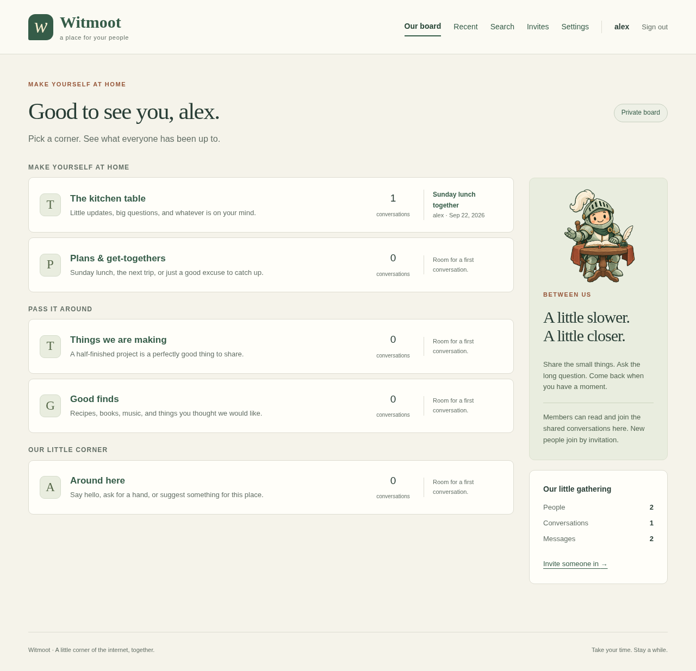

# Witmoot

A little corner of the internet for your people.

Witmoot is a bulletin board for personal use, families, and groups of friends. It takes
its familiar rooms, topics, and conversations from phpBB and vBulletin, and its
small, self-hosted clubhouse spirit from imvault.

**Comfyware** is software for your friends and family, run by and for the people
using it. It brings the personal spirit of the IndieWeb together with
self-hosting and a focus on small communities. Trust comes from a bounded social
context, governed by the people actually in it.

"Software you'd let your kids use" means an instance operated by people you
trust, under rules you understand. Each community establishes its own rules and
culture. Comfyware does not promise that every instance is suitable for every
family. It should provide the tools for local governance, protect the community's
ownership of its data, and make leaving or moving practical.

Low distraction. No recommendation algorithms, infinite scroll, streaks, or
engagement targets. Just the plans, little updates, good finds, and conversations
worth coming back to, whenever you choose.

The [comfyware principles](docs/product.md#what-comfyware-means) guide the tools
we build and the features we choose.

[copyparty](https://github.com/9001/copyparty) is another inspiration for that
practical, personal approach to running your own shared corner of the web.

One Go binary. One data directory. Server-rendered HTML, SQLite, and HTMX.
No frontend build step or external service needed to run it.

Sage and cream by day, dark greens by night. Choose **System**, **Light**, or
**Dark** in the header. System follows your device; an explicit choice stays in
this browser, including before you sign in.

Meet the **Moot Knight**: a little keeper of the round table, with a book,
a quill, and room for your people. The mascot appears on the welcome page and
beside the board.



*An isolated browser-test instance, with sample conversation data.*

## Come on in

Want to look around first? With Go 1.26 or later installed:

```sh
make demo
# Choose another local port if needed:
make demo PORT=9000
```

Open <http://127.0.0.1:8082> for the default demo. Sign in as **demo** (owner),
**freya**, or **jules** (members), all with password **demo-password**.
There are sample conversations and replies in every room, including public,
members-only, and owner-only conversations. Try Search, Settings, and Invites.
The planning nook is a private board: **freya** can post and edit her messages,
**jules** can read, and visitors cannot see it. Sign in as **demo** and choose
**Manage boards** to try changing those permissions.
The **Sunday regulars** group grants posting access to both members, with an
individual Read only override for jules. **Manage groups** shows that override
alongside each person's effective board access.
Visit **Archive** for Last summer, a board of past conversations. Owners can
restore it or try the archive and deletion confirmations in its board settings.

The demo listens only on localhost, uses a fresh temporary directory, and ignores
your `WITMOOT_*` configuration. Ctrl-C stops it and removes its data; the next run
starts fresh. It does not need an imvault server. Run `make` or `make help` to see
all available commands.

For your own board:

For a prebuilt Linux binary or Debian package, head to
[GitHub Releases](https://github.com/airencracken/witmoot/releases) and the
[binary installation guide](docs/releases.md).

The binary includes deployment help and HTTPS proxy config helpers:

```sh
witmoot --help
witmoot help create-owner
witmoot reset-link --username freya --expires 48h
witmoot proxy-config caddy --domain board.example.org > witmoot.Caddyfile
```

Use `nginx` or `apache` in place of `caddy` for those servers. The
[proxy guide](docs/reverse-proxies.md#generate-a-site-configuration) covers
custom ports, certificates, and installation.

Requires Go 1.26 or later. Dependencies are pinned in `go.mod`; HTMX 2.0.10 and
its license are included locally. The first build downloads Go dependencies.

```bash
make build
./bin/witmoot create-owner --username alex --password-prompt
./bin/witmoot
```

For scripts, pass one password line on standard input with
`./bin/witmoot create-owner --username alex --password-stdin`.

Open <http://127.0.0.1:8080>, sign in, and choose **Settings** to select Personal,
Private, or Open. New installations start in Private mode. Use **Invites** to
make a link for someone you know. Invitations default to one use and seven days;
owners choose labels, use limits, and expiry when creating them, and can revoke
them from the saved list. Passwords need at least 12 characters and may contain
up to 72 bytes.

An owner is created locally. Public registration never creates an owner, even on
an empty installation. Invited and openly registered accounts are always members.

For a permanent home, see the [deployment guide](docs/deployment.md): source
install targets, a Gentoo ebuild, OpenRC and systemd services, log rotation,
Caddy, and Docker Compose. [nginx and Apache are also supported](docs/reverse-proxies.md);
Caddy is the recommended proxy. Native services default to `127.0.0.1:8082`, so the
board and imvault can share a host without competing for the same port.

## Your place, your house rules

Use **Manage boards** as an owner to create boards, rename them, and choose
**Selected members only** for a private space. **Manage groups** lets owners
create named groups, edit their memberships, and rename or delete them. In board
settings, give a group **Read only** or **Read and post** access. Membership
changes take effect immediately across its boards, conversations, and images.

Individual permissions override every group grant: **No access** hides the board,
**Read only** prevents posting, and **Read and post** allows it. **Use groups**
inherits group grants; if groups overlap, Read and post wins. Without an individual
or group grant, a private board stays hidden. Existing individual grants become
overrides when upgrading; new members start with Use groups and no memberships.

Each group's management page shows its board grants, highlights individual
overrides, and lists effective access for each member. This includes site access
rules and archive status; each conversation's audience still applies. Deleting a
group requires its exact name as confirmation and removes only its memberships
and grants. Accounts, conversations, other groups, and individual overrides remain.

Owners can manage every board. Hidden boards and their conversations stay out
of the home page, recent activity, search, and counts, and direct links to their
conversations and attached images require access too. These restrictions still
apply when the site is Open. Existing shared boards keep their current access.
Witmoot's image URLs follow board access; linking a public image from imvault
does not change the original image's visibility there.

Board settings also offer **Archive board**, **Restore board**, and **Delete
board permanently**. Archiving moves a board off the home page and Recent into
the **Archive**. Its conversations and images remain readable by the same
people and searchable, with an Archived label. Nobody can post or edit until
an owner restores it; member permissions are preserved. Site totals include
archived conversations you can access.

Permanent deletion has a separate confirmation page showing how many
conversations, messages, and attachment links will be removed. You must type
the board's exact name to proceed. This cannot be undone. Original images in
imvault remain there, including images shared in other conversations. Choose
Archive when you want to keep the memories.

Authors can **Edit** their own messages while they have posting access. Changed
messages show an edited timestamp and keep their attached images. Editing does
not bump the conversation; stale edits warn you instead of overwriting a newer
change. The **Site access** text on the home page describes the site-wide mode;
it is a status label, not a button.

Owners can change the mode at **Settings** (`/settings`). It takes effect for new
requests immediately and is stored in SQLite, so it survives restarts.

| Mode | Who can browse and post | Joining | New conversations |
| --- | --- | --- | --- |
| **Personal** | Owners only | Disabled, including invitations | Owners only |
| **Private** | Signed-in members and owners | Invitation required | Members only |
| **Open** | Visitors can read public conversations; signed-in members can post | Anyone can register | Public |

Each conversation keeps its audience when the mode changes, and replies inherit
that audience. Conversations created before this feature remain members-only.
Owners can read every audience; members can read public and members-only topics.
Visitors can read public topics only, and only while the board is Open. Counts,
latest-topic summaries, and search respect those same audiences.

**Open signup lets anyone become a member, including access to existing
members-only conversations.** Members-only means behind sign-in; it does not
reserve conversations for the original invited group. Owner-only topics remain
restricted to owners. Personal mode blocks existing member sessions without
deleting their accounts or content. Unexpired invitations work again after
leaving Personal mode.

The composer shows the audience before posting. If a mode change affects that
audience while a draft is open, the server preserves the draft and asks the
author to review the new audience before resubmitting. There is no anonymous
posting or per-conversation audience editor in this version.

This follows imvault's idea of one application with selectable profiles and
preserved content audiences. Personal mode here is strictly owner-only, and
Open requires an account to post; it does not reproduce imvault's anonymous uploads.

## What is here

- Five starter rooms for everyday conversation, plans, projects, recommendations,
  and the group itself.
- Audience-aware topic lists, chronological messages, and pagination.
- New conversations and replies, with plain text, preserved line breaks, and
  bare web addresses shown as links.
- Optional imvault images: upload from a post, choose from your library, or
  paste an image link. Image access follows the conversation's audience.
- Search across conversation titles and message text.
- Owner invitations, member accounts, sign-in, and sign-out.
- Password changes for signed-in members, single-use reset links owners hand
  over, an optional SMTP relay that can email them, and an interactive
  `witmoot admin` view for the same account work.
- A per-member export: download your own posts and their context as a Zip with
  a versioned manifest and a page that opens offline.
- Responsive pages and HTMX navigation. The same forms work without JavaScript.
- Transactional schema initialization, topic creation, replies, and invitation
  redemption. Restarting keeps your conversations and sessions.

One installation is one community, with shared and private boards and reusable
user groups. Private messages are not implemented. Owner-only conversations are
shared among all owner accounts.

## Make it yours

| Setting | Default | Purpose |
| --- | --- | --- |
| `WITMOOT_NAME` | `Witmoot` | Name in the header and page titles |
| `WITMOOT_BASE_URL` | request origin | Public HTTP(S) origin for shareable invitation links |
| `WITMOOT_DATA_DIR` | `./data` | Database, journal files, and optional imvault encryption key |
| `WITMOOT_ADDR` | `127.0.0.1:8080` | HTTP listen address |
| `WITMOOT_SECURE_COOKIES` | `false` | Set `true` behind HTTPS |
| `WITMOOT_TRUSTED_PROXIES` | unset | Comma-separated proxy IPs/CIDRs allowed to supply client addresses |
| `WITMOOT_IMVAULT_URL` | unset | Optional imvault server URL, such as `https://photos.example.org` |
| `WITMOOT_SMTP_HOST` | unset | Optional SMTP relay; empty leaves mail disabled |
| `WITMOOT_SMTP_PORT` | `587` | Relay port |
| `WITMOOT_SMTP_USERNAME` | unset | Relay username, if it needs one |
| `WITMOOT_SMTP_PASSWORD` | unset | Relay password, if it needs one |
| `WITMOOT_SMTP_FROM` | `Witmoot <no-reply@localhost>` | From address for outgoing mail |
| `WITMOOT_SMTP_TLS` | `starttls` | `starttls`, `implicit`, or `none` |

```bash
WITMOOT_NAME='Our little corner' WITMOOT_ADDR=127.0.0.1:9000 make run
```

The starter rooms are seeded once by the initial migration. Their names are
currently fixed; room management is future work. The default data directory is
created with owner-only access. An existing directory keeps its permissions.

## Invitations for your people

Owners manage invitations under **Invites**. Add an optional label, choose the
number of accounts it may admit (`0` for unlimited), and set an expiry in days
(blank or `0` for never). New accounts are always members.

Copy the full link or code when it is created; only a digest and identifying
prefix are stored. The saved list shows usage, expiry, and status, with a
**Revoke invitation** button for open invitations. Revocation prevents new
registrations without changing accounts that already joined. Failed
registrations do not consume a use. Existing invitations retain their original
single-use limit and expiry after upgrading.

Links are complete URLs even without JavaScript. Set `WITMOOT_BASE_URL` to the
public origin, such as `https://board.example.org`, behind a reverse proxy.
Without it, links use the request host and HTTPS when secure cookies are enabled
or the request itself uses TLS. Personal mode continues to disable invitations
and registration; unexpired, unrevoked invitations work again after leaving it.

## When someone is locked out

Owners open **Members** to see every account. **Create a reset link** makes a
single-use link a member can open to choose a new password; it expires after 24
hours and is shown once, so copy it and hand it over. **Cancel reset link** stops
a link that should no longer work. A member can also change their own password
under **Account**, which asks for the current one and signs other devices out.

On the command line, `witmoot set-password --username NAME` replaces a password
outright and ends that account's sessions, for when nobody can use a link.
`witmoot reset-link --username NAME [--expires 48h]` prints a link and its code,
and `witmoot list-users` lists accounts with their roles and addresses. On a
terminal, `witmoot admin` opens an interactive view of the same work: browse
members, create owners, issue or cancel reset links, and set passwords. All of
these read `WITMOOT_DATA_DIR` from the service configuration and, when run as
root, repeat the work as the service user.

Members may add an optional email address under **Account**. When an operator has
configured an SMTP relay, an owner can email a reset link instead of copying it.
Witmoot needs no mail to run, and sending stays off unless a relay is set.

## Images with imvault

Set `WITMOOT_IMVAULT_URL` to your imvault server and restart Witmoot. Each member
can then open **Images** and connect an API key from their own imvault account.
Uploads and library selection need a connection; public pasted links do not.
See [the imvault setup guide](docs/imvault.md) for access rules and backups.

## Keeping the house in order

Use an HTTPS reverse proxy for a hosted installation, keep the app port private,
and set `WITMOOT_SECURE_COOKIES=true`. Secure mode uses `__Host-` cookies.

Passwords use bcrypt. Session, invitation, and reset tokens are random and only
their SHA-256 hashes are stored. Reset links work once and expire. Sessions
expire after seven days. Forms require CSRF tokens and use Go's cross-origin
protection. User text is escaped; only bare `http://` and `https://` addresses
are turned into links, and nothing else is treated as markup. Private pages send
`Cache-Control: no-store` and disable HTMX history storage. Assets are served
locally under a restrictive content security policy.

Sign-in, open registration, and invitation redemption share a limit of 20 attempts per 15 minutes
per client IP. The limiter is in memory and does not trust forwarded
headers unless the peer is in `WITMOOT_TRUSTED_PROXIES`. Configure this behind
Caddy so visitors have separate budgets; otherwise they share the proxy's
budget. See [running beside imvault](docs/imvault.md#running-beside-imvault).

For a simple backup, **stop the server and copy the entire data directory**.
Restore it with the server stopped, then start Witmoot against that directory.
Do not copy only the live `.db` file while SQLite is using WAL journaling.

**Taking your data is a core comfyware requirement.** Under **Account**, each
member can download their own contributions as a Zip archive: a versioned
`manifest.json`, a readable `archive.html` that opens offline, and the
conversation and image-reference context needed to understand them. It holds
that member's messages only, never anyone else's, and never credentials. Images
are references to the imvault preview that was posted; originals come from your
imvault account export. Operator backups remain the copy of the whole board.

A portable community archive, so a whole board can move, and import workflows
are core work still to do. See the
[data portability requirements](docs/data-portability.md), informed by imvault's
existing account exports.

This is a first working foundation. Member removal, post deletion, and
moderation are not implemented yet. Account recovery covers member-initiated
password changes, owner-issued reset links, and the local `set-password`
command; there is no self-service email reset, and mail stays off until a relay
is configured. Do not use it as the sole copy of irreplaceable family material.
SQLite data is not encrypted at rest.

## Working on it

```bash
make help    # available commands and installation options
make check   # formatting, JavaScript tests (Node required), vet, and race tests
make build   # standalone binary; no cgo required
```

Tests cover all three modes, audience filtering, migration from the original
private schema, persisted settings, stale forms and registration policy,
invitation races and rollback, session expiry, CSRF, role checks, escaping,
search literals, pagination, and failed writes.
Image tests cover the API contract, encrypted connections, all three attachment
paths, audience checks, input limits, upstream failures, and upload cleanup.
Packaging tests exercise staged installs, preserved configuration, service
settings, and log rotation. Install `logrotate` to run the rotation integration
test; it reports a skip when the tool is unavailable.

Browser checks use Node.js and Playwright only as development tools:

```bash
npm --prefix scripts/browser ci
cd scripts/browser
npx playwright install chromium
cd ../..
make test-browser
```

These checks start an isolated temporary instance and exercise the full flow with
HTMX enabled and JavaScript disabled, including changing modes in Settings,
public browsing, open registration, Personal access restrictions, mobile layout,
and browser security policy checks. They fail if browser tooling is missing. Optional screenshots:
`WITMOOT_SCREENSHOT_DIR=/tmp/witmoot-screenshots make test-browser`.

To also test against a real imvault server, build imvault separately and run:

```bash
IMVAULT_BINARY=/path/to/imvault make test-imvault
```

This starts both apps with temporary data and checks image workflows with HTMX
enabled and JavaScript disabled. It creates disposable accounts and API keys;
it does not use your running imvault installation.

The product direction lives in [docs/product.md](docs/product.md).

## License

Copyright (C) 2026 Marcus J. Hildum.

Witmoot is licensed under the GNU Affero General Public License, version 3 or
later (`AGPL-3.0-or-later`), like imvault. See [LICENSE](LICENSE).
This program comes without any warranty.

Third-party components retain their own licenses; see [THIRD_PARTY.md](THIRD_PARTY.md).
